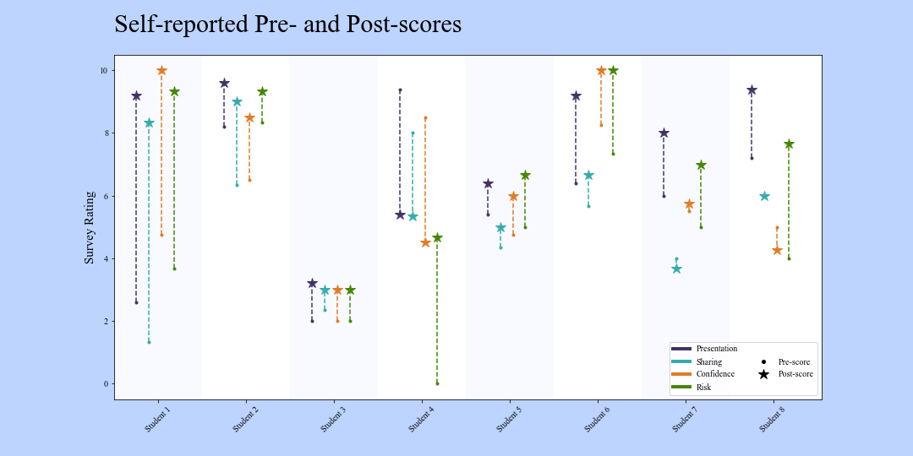
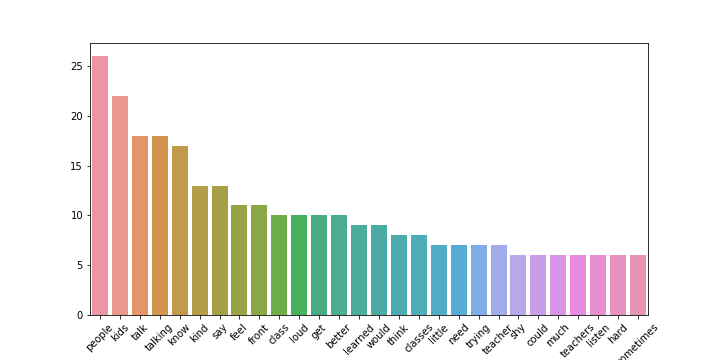

# Tier II Interventions Project
The project described below was a collaboration between Anna E. Colburn, M.A. _(research design and analysis)_ and Tyler Buck _(data visualizations)_. The project description and analysis below is written by me, Tyler Buck and is not intended to represent Ms. Colburn's work; rather it is intended to display the data visualizations I produced for her project in the context of her research. Ms. Colburn's research was submitted as a Master's of Education thesis in completion of the Educational Leadership and Policy Studies program through the Morgridge College of Education at the University of Denver in 2020.

## Intervention Tiers
While managing student behavior may vary from school to school, one popular model, and the one observed in this study, is the [Multi-Tiered System of Support](https://www.pbis.org/pbis/tiered-framework) (MTSS). The tiers refer to levels of _support_ and do not refer to a student's abilities or behaviors. As the tier increases (1,2,3), the supports become more targeted from **Tier I** (all students, general solutions) to **Tier III** (individualized, specific solutions).

Often times when a student does not respond to Tier I interventions, the student will be provided Tier III solutions in lieu of a Tier II. Tier II solutions can be complicated to implement as they are not as attractive as a custom response to a student's specific needs, but these mid-range interventions can provide real results efficiently as this study sought to prove.

## Research Description
Ms. Colburn conducted a research study involving eight 6th grade students. The  study tracked student progress as it related to behavior, confidence, and public presentation. Each week for the duration of the study, the 6th grade students would read a book to a group of 3rd grade students.

At the beginning of the study, the students were assessed by themselves, their Literature teacher, and the 3rd grade class's (Elementary) teacher; these scores comprised the student's Pre-scores. A similar assessment with two additional questions was conducted at the end of the study, comprising the Post-scores. Additionally, at the end of the study, Ms. Colburn conducted interviews with each 6th grade student, which were recorded and transcribed.

## Analysis: Assessments
Per the findings, each student achieved some improvement in every category (Presentation, Sharing, Confidence, and Risk) in at least one assessment (self, Lit Teacher, or Elementary Teacher).
### Self-Reported
Success was nearly universally recognized in the self-reported assessments. One notable exception is student 4 who, despite suffering a period of trauma during this study, self-affirmed significant improvement in positive risk-taking. With few exceptions, the gains recognized by the students are considerable.

### Literature Teacher-Reported
In what might be deemed "The Falling Star" graph, scores from the literature teacher tell a less optimistic story than the self-reported scores. Curiously, the student perceived as the most improved according to the Literature teacher, Student 3, recognized only modest gains in themselves. One explanation of this disparity could be explained by an Emic view informed by the low-esteem a student may hold of themselves before the study and the recognition of the progress made in overcoming the challenges of reading to a group of Elementary school children, seeing tremendous progress as a result, vs an Etic view posed by a teacher who did not witness the challenges overcome by the students and judged only the behaviors in a different environment (i.e. the Literature classroom.)

### Elementary Teacher-Reported
The Elementary Teacher's assessments proved more optimistic, though more modest than the Self-reported assessments. It should be noted that, as a limitation in this study, the Post-Assessment was completed by a substitute teacher who did not get to observe the full study.

## Analysis: Interviews
Though not included in Ms. Colburn's report of the study, I thought a quantitative analysis of the interviews might prove interesting, even if not necessary significant or meaningful.

A simple breakdown of common words used in the interviews is telling: It's about "people". Excluding common words (the, a/an, and, I/me, you, them, etc.), a few of the most common words are "people","talk/talking", "know", "say", and "front". Considering the purpose of this study was to gauge the improvement of students who were "shy", another word commonly used in the interviews, or even silent in their 6th grade classes, the prevalence of these words maay suggest an immeasurable improvement in the students' confidence, their willingness to take positive risks, and to present and be present while sharing their knowledge and themselves to other people.
### Word Cloud
 
### Word Counts (n >= 5)
